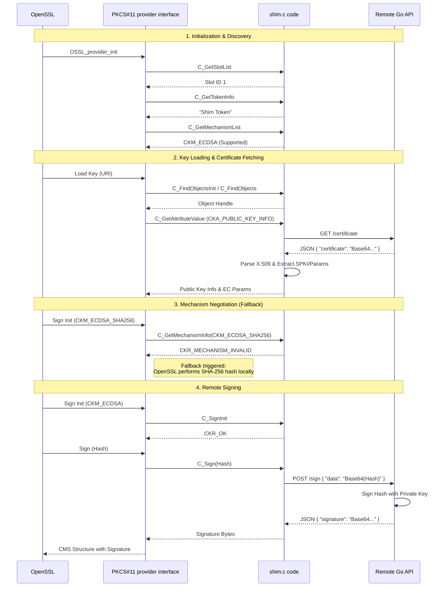

# CMS Remote Signature Flow

This document details the step-by-step process of generating a CMS (Cryptographic Message Syntax) signature using `openssl cms -sign` with the `pkcs11-provider` and our custom remote shim.

## Overview

The process involves interaction between three main components:
1.  **OpenSSL**: The command-line tool and cryptographic library initiating the operation.
2.  **PKCS#11 Provider (Shim)**: The bridge that translates PKCS#11 calls into HTTP requests.
3.  **Remote API**: The external service holding the actual private key and performing the signing.

## Sequence Diagram

## Detailed Steps

### 1. Initialization & Discovery
OpenSSL loads the `pkcs11-provider`. The provider queries the shim to discover available "slots" (virtual card readers) and "tokens" (virtual smart cards).
- **Slot Discovery**: The shim reports a single slot (ID 1).
- **Token Info**: The shim reports a token named "Shim Token".
- **Mechanism List**: The shim declares it supports `CKM_ECDSA` (Elliptic Curve Digital Signature Algorithm).

### 2. Key Loading & Certificate Fetching
OpenSSL requests to load the private key specified by the PKCS#11 URI.
- **Find Object**: The provider asks the shim to find the key object. The shim returns a handle.
- **Attribute Retrieval**: The provider needs the Public Key information to construct the CMS structure. It asks for `CKA_PUBLIC_KEY_INFO` and `CKA_EC_PARAMS`.
- **Remote Fetch**: The shim performs a `GET /certificate` request to the remote API.
- **Extraction**: The shim parses the returned X.509 certificate to extract the Subject Public Key Info (SPKI) and EC Parameters (Curve ID), caching them for future use.

### 3. Mechanism Negotiation (The Fallback)
OpenSSL wants to sign using `ECDSA-SHA256` (hashing and signing in one step).
- **Check Support**: It asks the shim if it supports `CKM_ECDSA_SHA256`.
- **Rejection**: The shim returns `CKR_MECHANISM_INVALID` because it only supports raw ECDSA signing, not the combined hash-and-sign operation.
- **Fallback**: OpenSSL detects this and automatically handles the SHA-256 hashing in software, preparing the 32-byte hash to be signed.

### 4. Remote Signing
OpenSSL proceeds to sign the hash.
- **Sign Init**: The provider initializes the signing operation with `CKM_ECDSA`.
- **Execution**: OpenSSL passes the SHA-256 hash to the provider.
- **Remote Request**: The shim encodes the hash in Base64 and sends a `POST /sign` request to the remote API.
- **Signing**: The remote API uses the actual private key (which never leaves the server) to sign the hash.
- **Completion**: The signature is returned to the shim, then to the provider, and finally embedded into the CMS structure by OpenSSL.

## Glossary of Terms

### Cryptographic Concepts
*   **CMS (Cryptographic Message Syntax)**: A standard syntax for storing signed, enveloped, digested, and encrypted data. It's the underlying format for S/MIME email encryption and signing.
*   **PKCS#11**: A standard API (Application Programming Interface) for accessing cryptographic hardware (like smart cards or HSMs). Our "shim" acts as a virtual smart card.
*   **SPKI (Subject Public Key Info)**: A standard format for representing a public key and its algorithm. It's how the public key is stored inside an X.509 certificate.
*   **OID (Object Identifier)**: A unique sequence of numbers used to identify algorithms (e.g., `1.2.840.10045.4.3.2` for `ecdsa-with-SHA256`) and other objects.
*   **Digest (Hash)**: A fixed-size string of bytes (e.g., 32 bytes for SHA-256) generated from the input data. It acts as a unique fingerprint. Signing the digest is equivalent to signing the data itself but much more efficient.

### PKCS#11 Specifics
*   **Slot**: A logical reader. In hardware terms, the slot is where you insert the card.
*   **Token**: The logical device (card) in the slot. It contains the keys.
*   **Mechanism**: A specific cryptographic operation supported by the token (e.g., `CKM_ECDSA`, `CKM_RSA_PKCS`).
*   **Attribute**: A property of an object (key), such as its label, ID, or value. `CKA_LABEL`, `CKA_ID`.
