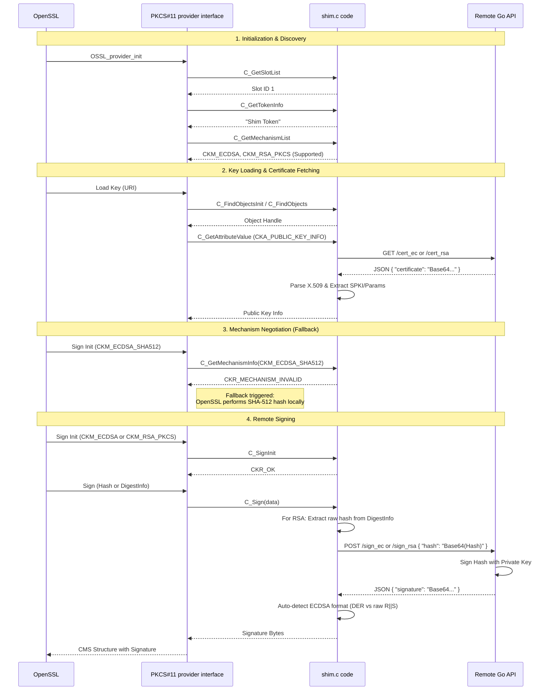

# CMS Remote Signature Flow

This document details the step-by-step process of generating a CMS (Cryptographic Message Syntax) signature using `openssl cms -sign` with the `pkcs11-provider` and this custom remote shim.

## Overview

The process involves interaction between three main components:
1.  **OpenSSL**: The command-line tool and cryptographic library initiating the operation.
2.  **PKCS#11 Provider (Shim)**: The bridge that translates PKCS#11 calls into HTTP requests.
3.  **Remote API**: The external service holding the actual private key and performing the signing.

## Sequence Diagram



## Detailed Steps

### 1. Initialization & Discovery
OpenSSL loads the `pkcs11-provider`. The provider queries the shim to discover available "slots" (virtual card readers) and "tokens" (virtual smart cards).
- **Slot Discovery**: The shim reports a single slot (ID 1).
- **Token Info**: The shim reports a token named "Shim Token".
- **Mechanism List**: The shim declares it supports `CKM_ECDSA` and `CKM_RSA_PKCS` (raw signing mechanisms).

### 2. Key Loading & Certificate Fetching
OpenSSL requests to load the private key specified by the PKCS#11 URI.
- **Find Object**: The provider asks the shim to find the key object. The shim returns a handle.
- **Attribute Retrieval**: The provider needs the Public Key information to construct the CMS structure. It asks for `CKA_PUBLIC_KEY_INFO` and key-specific attributes.
- **Remote Fetch**: The shim performs a `GET` request to the configured certificate endpoint (e.g., `/cert_ec` or `/cert_rsa`).
- **Extraction**: The shim parses the returned X.509 certificate to extract:
  - For EC keys: Subject Public Key Info (SPKI) and EC Parameters (Curve OID, EC Point)
  - For RSA keys: Modulus and Public Exponent
- **Key Type Detection**: The shim auto-detects the key type (EC or RSA) from the certificate.

### 3. Mechanism Negotiation (The Fallback)
OpenSSL wants to sign using a combined hash-and-sign mechanism (e.g., `ECDSA-SHA512` or `SHA512-RSA-PKCS`).
- **Check Support**: It asks the shim if it supports the combined mechanism.
- **Rejection**: The shim returns `CKR_MECHANISM_INVALID` because it only supports raw signing, not the combined hash-and-sign operation.
- **Fallback**: OpenSSL detects this and automatically handles the hashing in software, preparing the hash (or DigestInfo for RSA) to be signed.

### 4. Remote Signing
OpenSSL proceeds to sign the hash.
- **Sign Init**: The provider initializes the signing operation with the raw mechanism (`CKM_ECDSA` or `CKM_RSA_PKCS`).
- **Execution**: OpenSSL passes the data to the provider:
  - For ECDSA: The raw hash bytes
  - For RSA PKCS#1 v1.5: A DigestInfo structure (ASN.1 wrapper containing algorithm OID + hash)
- **DigestInfo Extraction (RSA only)**: The shim extracts the raw hash from the DigestInfo structure.
- **Remote Request**: The shim encodes the hash in Base64 and sends a `POST` request to the sign endpoint.
- **Signing**: The remote API uses the actual private key (which never leaves the server) to sign the hash.
- **Format Auto-Detection (ECDSA)**: The shim auto-detects whether the API returned:
  - **DER format**: ASN.1 `SEQUENCE { INTEGER r, INTEGER s }` - converts to raw R||S
  - **Raw format**: Fixed-size R||S concatenation - used as-is
- **Completion**: The signature is returned to the shim, then to the provider, and finally embedded into the CMS structure by OpenSSL.

## Configuration

The shim behavior is controlled by environment variables:

| Variable                              | Description                                          | Default                                |
| ------------------------------------- | ---------------------------------------------------- | -------------------------------------- |
| `PKCS11_SHIM_URL`                     | Base URL of the remote API                           | (required)                             |
| `PKCS11_SHIM_API_CERT_GET_PATH`       | Path to fetch certificate                            | `/certificate`                         |
| `PKCS11_SHIM_API_SIGN_PATH`           | Path to submit signing requests                      | `/sign`                                |
| `PKCS11_SHIM_API_CERT_JSON_FIELD`     | JSON field containing certificate                    | `certificate`                          |
| `PKCS11_SHIM_API_SIGN_JSON_FIELD`     | JSON field containing signature in response          | `signature`                            |
| `PKCS11_SHIM_API_SIGN_REQUEST_FORMAT` | JSON template for sign request                       | `{"data": "%s", "mechanism": "ECDSA"}` |
| `PKCS11_SHIM_API_SIGN_RETURN_TYPE`    | Set to `base64` if response is raw base64 (not JSON) | (unset = JSON)                         |
| `PKCS11_SHIM_API_SIGN_ENCODING`       | Signature encoding: `base64` or `base64url`          | `base64`                               |
| `PKCS11_SHIM_AUTH`                    | Authentication header as `Name:Value`                | (none)                                 |
| `PKCS11_SHIM_SSL_VERIFY`              | Set to `0` to disable SSL verification               | `1`                                    |
| `PKCS11_SHIM_DEBUG`                   | Debug output destination (e.g., `file:/dev/stderr`)  | (none)                                 |

## ECDSA Signature Formats

Different signing backends return ECDSA signatures in different formats:

| Backend          | Format | Encoding  | JSON Field  | Description                                       |
| ---------------- | ------ | --------- | ----------- | ------------------------------------------------- |
| AWS KMS          | DER    | base64    | `signature` | ASN.1 encoded `SEQUENCE { INTEGER r, INTEGER s }` |
| Google Cloud KMS | DER    | base64    | `signature` | ASN.1 encoded                                     |
| HashiCorp Vault  | DER    | base64    | `signature` | ASN.1 encoded (default `marshaling_algorithm`)    |
| Azure Key Vault  | Raw    | base64url | `value`     | Fixed-size R \|\| S concatenation                 |
| OpenSSL pkeyutl  | DER    | base64    | `signature` | ASN.1 encoded                                     |

The shim **auto-detects** the format and converts DER to raw R||S when needed, since PKCS#11 expects the raw format.

### Azure Key Vault Configuration Example

Azure Key Vault uses a different API format than other providers:
- **base64url encoding** instead of standard base64
- **`value` field** instead of `signature` for the response
- **Raw R||S format** for ECDSA signatures (no DER conversion needed)

```bash
export PKCS11_SHIM_URL="https://myvault.vault.azure.net"
export PKCS11_SHIM_API_SIGN_PATH="/keys/my-key/sign"
export PKCS11_SHIM_API_SIGN_ENCODING="base64url"
export PKCS11_SHIM_API_SIGN_JSON_FIELD="value"
export PKCS11_SHIM_API_SIGN_REQUEST_FORMAT='{"alg": "ES384", "value": "%s"}'
export PKCS11_SHIM_AUTH="Authorization:Bearer <token>"
```

## Glossary of Terms

### Cryptographic Concepts
*   **CMS (Cryptographic Message Syntax)**: A standard syntax for storing signed, enveloped, digested, and encrypted data. It's the underlying format for S/MIME email encryption and signing.
*   **PKCS#11**: A standard API (Application Programming Interface) for accessing cryptographic hardware (like smart cards or HSMs). Our "shim" acts as a virtual smart card.
*   **SPKI (Subject Public Key Info)**: A standard format for representing a public key and its algorithm. It's how the public key is stored inside an X.509 certificate.
*   **OID (Object Identifier)**: A unique sequence of numbers used to identify algorithms (e.g., `1.2.840.10045.4.3.4` for `ecdsa-with-SHA512`) and other objects.
*   **Digest (Hash)**: A fixed-size string of bytes (e.g., 64 bytes for SHA-512) generated from the input data. It acts as a unique fingerprint. Signing the digest is equivalent to signing the data itself but much more efficient.
*   **DigestInfo**: An ASN.1 structure used in RSA PKCS#1 v1.5 signatures that wraps the hash algorithm OID and the hash value together.

### PKCS#11 Specifics
*   **Slot**: A logical reader. In hardware terms, the slot is where you insert the card.
*   **Token**: The logical device (card) in the slot. It contains the keys.
*   **Mechanism**: A specific cryptographic operation supported by the token (e.g., `CKM_ECDSA`, `CKM_RSA_PKCS`).
*   **Attribute**: A property of an object (key), such as its label, ID, or value. `CKA_LABEL`, `CKA_ID`, `CKA_MODULUS`, `CKA_EC_POINT`.
